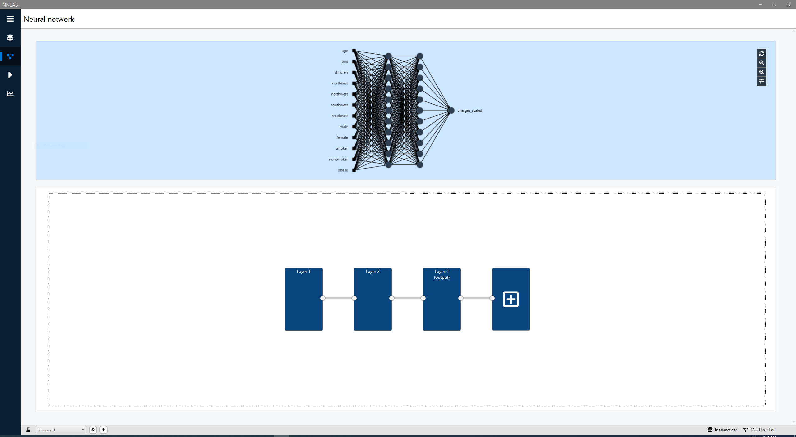
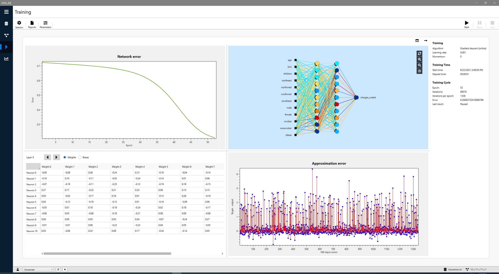
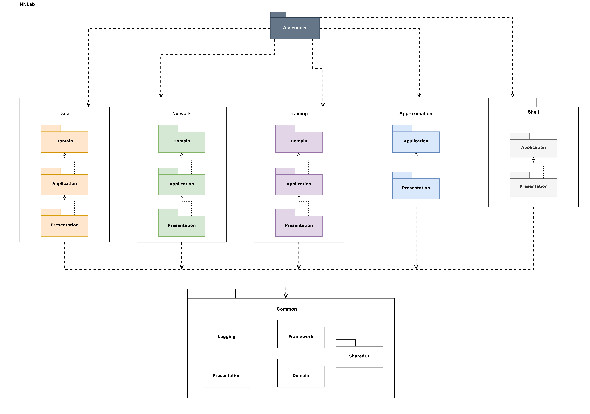
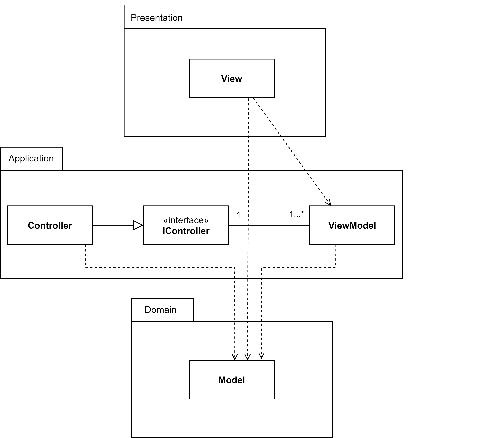

# NNLab

Desktop application that allows to create, train and visualize neural networks.
It was part of my BEng thesis.
### Remaining parts of project:
- NNLib - neural network library https://github.com/pekalam/NNLib
- NNControl - WPF control displaying neural network visualization https://github.com/pekalam/NNControl

## Main capabilities:
- Read data from csv, enter a set of points, normalize and visualize data
- Create and visualize neural network
- Configure training process and train neural network using high-performance library (CPU only)
- Visualize training process with 5 interactive charts updated at real-time
- View prediction results

## Frameworks and libraries:
- WPF
- Prism
- Math.NET numerics (https://numerics.mathdotnet.com/)
- MahApps.Metro (https://github.com/MahApps/MahApps.Metro)

## Screenshots

More screenshots: https://github.com/pekalam/nnlab/tree/master/gh_images/screenshots

## Short overview of architecture
TODO
### Package level overview

### MVVM architecture

